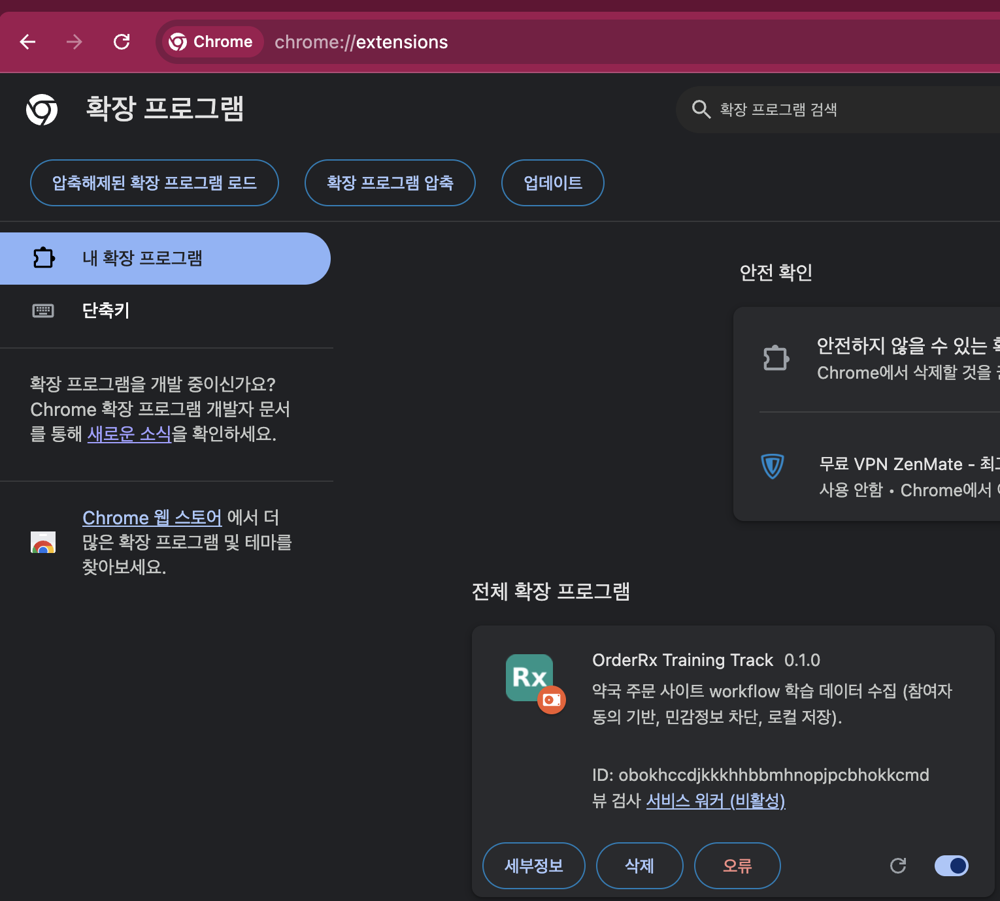
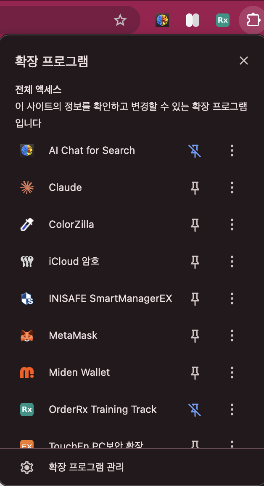
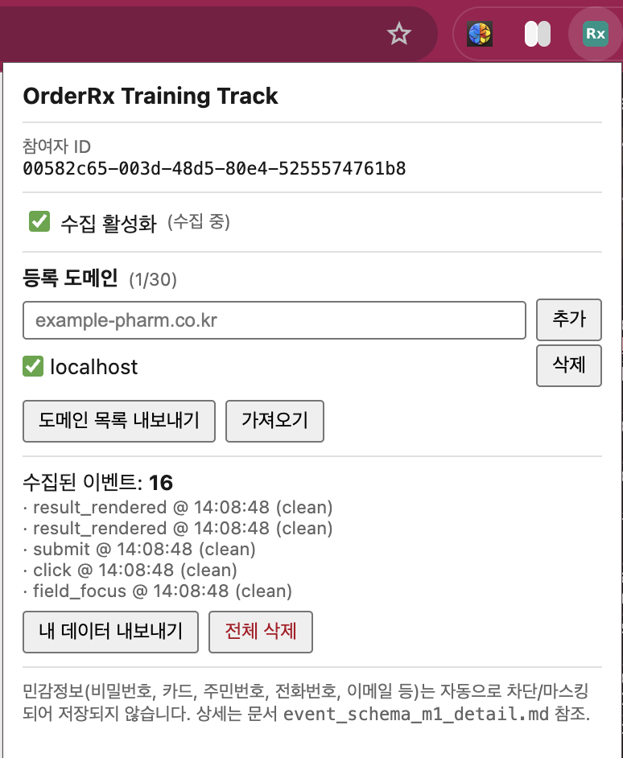
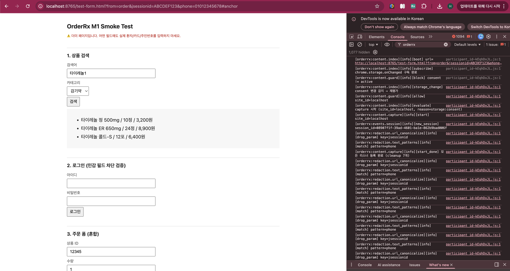

# OrderRx 참여자 가이드

**읽는 대상**: OrderRx Training Track에 참여하기로 하신 약국 테스터분들.
**이 문서의 목적**: 확장프로그램을 안전하게 설치·사용하고, 본인의 데이터가 어떻게 다뤄지는지 스스로 확인할 수 있게 하는 것.

> 프로젝트 상세 원칙은 `04_policies/privacy_and_data_collection.md` 와 `04_policies/participant_transparency_requirements.md` 에 있습니다. 이 가이드는 그 원칙을 참여자 관점에서 풀어 쓴 것입니다.

---

## 1. OrderRx가 무엇인가

OrderRx는 약국 주문 사이트의 **작업 흐름(workflow)** 을 이해하기 위한 학습용 데이터 수집 확장프로그램입니다. 수집된 데이터는 사이트별 자동화 어댑터 설계와 모델 학습에 사용됩니다.

**핵심** (v0.3.0부터): 수집된 이벤트는 먼저 본인 브라우저에 저장된 뒤, 운영자의 수집 서버(Supabase, 서울 리전)로 **자동 업로드**되고, 업로드가 확인된 데이터는 브라우저에서 자동 삭제됩니다. 업로드되는 것은 아래 목록 그대로의 "행동 메타데이터"뿐이며, 민감정보는 저장 전 단계에서 차단되므로 서버에도 존재할 수 없습니다. 업로드 현황은 popup에서 항상 확인할 수 있고, "내 데이터 내보내기"로 업로드 대기 중인 데이터를 직접 열어볼 수 있습니다.

### 참여 동의 절차 (필수)

확장을 설치하고 popup을 처음 열면 **참여 동의 화면**이 표시됩니다. 함께 배포된 동의서(`CONSENT.md`)의 요약을 읽고 "위 내용을 읽고 이해했으며 동의합니다"에 체크한 뒤 "동의하고 시작"을 눌러야만 수집·업로드가 시작됩니다. **동의 전에는 어떤 데이터도 수집되지 않습니다.** 동의 시각·동의서 버전·확장 버전이 기록되며, 동의서 내용이 의미 있게 바뀌면 재동의를 요청합니다. 참여 철회와 서버 데이터 삭제 요청은 언제든 가능합니다 (동의서 §6).

---

## 2. 수집하는 것과 수집하지 않는 것

### 수집하는 것 (의미 정보만)

- 어떤 사이트의 어떤 페이지를 열었는지 (URL은 세션 토큰/전화번호/카드번호 같은 파라미터 제거 후 저장)
- 어떤 버튼/링크를 클릭했는지 (좌표 아님, 요소의 의미만)
- 어떤 입력 필드에 초점이 갔는지 (필드 **이름**만)
- 입력 값의 **길이**와 **분류** (예: "6~8자리 숫자"), 값 원문은 절대 저장 안 함
- 폼 제출 시각과 필드 개수
- 페이지 이동 이벤트

### 절대 수집하지 않는 것

- 아이디 / 비밀번호 / OTP / 인증번호 **원문**
- 카드번호 / 계좌번호 / 결제정보
- 환자명 / 연락처 / 주소 / 주민등록번호 / 생년월일
- 쿠키 / 세션 토큰 / 인증 헤더
- 마우스 좌표 / 화면 캡처 / 키 입력 원문

비밀번호 필드(`<input type="password">`)는 값 접근 자체가 차단되며, 필드명·라벨에서 위 범주가 감지되면 해당 필드는 `redaction_status: blocked` 로 표시되고 입력 길이는 `-1` 고정으로 저장됩니다.

---

## 3. 설치 방법 (Chrome)

### 3.1 배포 파일 준비

1. 운영자로부터 받은 `orderrx-extension-0.3.0.zip` 을 컴퓨터에 저장한 뒤 압축을 풉니다. 풀면 `orderrx-extension-0.3.0` 폴더가 생깁니다.
2. 이 폴더를 **안정적인 로컬 경로**에 둡니다. 예: `~/Tools/orderrx-extension-0.3.0/` (macOS), `C:\Tools\orderrx-extension-0.3.0\` (Windows).
   - ⚠️ **iCloud Drive / OneDrive / Google Drive 같은 클라우드 동기화 폴더 안에는 두지 마세요.** 동기화가 파일을 일시적으로 비우면 확장이 깨집니다.
   - ⚠️ **"다운로드" 폴더도 피하세요.** 실수로 청소될 때 같이 지워질 수 있습니다.
3. 폴더 안을 열어 `manifest.json` 파일이 **바로** 보이는지 확인합니다. 한 단계 더 들어간 위치에 있다면 그 안쪽 폴더가 실제 사용할 폴더입니다.

### 3.2 개발자 모드 켜기

Chrome은 비공개 확장(=Chrome Web Store를 거치지 않은 확장)을 로드하려면 "개발자 모드"를 먼저 켜야 합니다. 이 모드를 켠다고 브라우저가 위험해지거나 설정이 변하지는 않습니다 — 단지 unpacked 확장 로드 버튼을 노출시키는 토글입니다.

1. Chrome 주소창에 `chrome://extensions` 를 입력하고 Enter.
2. 화면 **우측 상단**을 보면 "개발자 모드 / Developer mode" 라는 토글이 있습니다. 클릭해서 켭니다.
3. 토글이 켜지면 **왼쪽 상단에 새 버튼 3개**가 나타납니다:
   - "압축해제된 확장 프로그램을 로드합니다 / Load unpacked"
   - "확장 프로그램 압축 / Pack extension"
   - "업데이트 / Update"
4. 이 버튼들이 보이지 않으면 개발자 모드가 아직 꺼져 있는 것입니다. 토글을 다시 확인하세요.

### 3.3 확장 로드

1. "압축해제된 확장 프로그램을 로드합니다" 클릭.
2. 3.1에서 준비한 `orderrx-extension-0.3.0` 폴더를 선택 (안의 `manifest.json` 이 아니라 **폴더 자체**를 선택).
3. 확장 목록에 "OrderRx Training Track" 카드가 나타나면 성공입니다.

로드가 끝나면 `chrome://extensions` 화면에 OrderRx 카드가 다음처럼 나타납니다:



### 3.4 툴바에 고정

Chrome 툴바 우측의 **퍼즐 조각 아이콘**을 눌러 설치된 확장 목록을 엽니다. OrderRx 옆의 핀 아이콘을 클릭해 고정해 두면 매번 popup 열기가 편합니다:



**초기 상태는 Pause (일시 정지)** 입니다. 명시적으로 활성화하기 전까지는 어떤 데이터도 수집되지 않습니다.

### 3.5 설치 이후 주의

- **폴더를 옮기거나 이름을 바꾸지 마세요.** Chrome은 설치 시점의 경로를 기억합니다. 옮기면 확장이 비활성화되거나 다시 로드해야 합니다.
- **Chrome을 재시작한 뒤에도 OrderRx가 남아있는지** 한 번 확인하세요. 드물게 unpacked 확장이 재시작 후 사라지는 환경이 있습니다. 그런 경우 같은 폴더로 다시 로드하면 됩니다.

---

## 4. 최초 설정

툴바의 OrderRx 아이콘을 누르면 다음과 같은 popup이 열립니다:



여기서 다음 단계를 진행합니다.

1. **참여자 ID (participant_id)** 가 표시되는지 확인. 이는 설치 시 1회 발급되는 UUID이며, 실명·이메일·계정과 무관한 익명 ID입니다.
2. **도메인 추가**: 본인이 사용하는 약국 주문 사이트의 호스트명을 입력합니다 (예: `example-order.co.kr`). 최대 30개까지 등록 가능합니다.
   - (Chrome Web Store에서 설치한 경우에만) "추가"를 누르면 Chrome이 **"[사이트]의 데이터를 읽고 변경할 수 있음" 권한 요청 창**을 띄웁니다. **"허용"을 눌러야** 그 사이트에서 수집이 가능합니다. 실수로 거부했다면 도메인을 다시 추가하면 됩니다. zip으로 설치한 경우에는 이 창이 뜨지 않습니다.
3. 각 도메인은 개별 ON/OFF 토글이 있습니다. 특정 사이트만 잠깐 끄고 싶을 때 사용하세요.
4. 준비가 끝나면 popup 상단의 **수집 활성화 체크박스**를 켭니다. 상태가 "(수집 중)" 으로 바뀌면 해당 도메인에서 수집이 시작됩니다.

---

## 5. 평상시 사용

### 잠깐 멈추고 싶을 때

popup의 수집 활성화 체크박스를 끄면 **즉시** 모든 사이트에서 수집이 중단됩니다. 이미 열려 있던 탭에서도 바로 리스너가 해제되므로, 체크를 끄고 나서 하는 행동은 기록되지 않습니다.

### 특정 사이트만 끄고 싶을 때

도메인 목록의 해당 행에 있는 체크박스를 끄면 그 사이트에서만 수집이 멈춥니다. 나머지는 그대로 수집됩니다.

### 로그인 / 결제 / 환자 정보 입력 시

민감 필드는 자동으로 차단되지만, 불안하면 작업 전에 체크박스를 끄는 것이 가장 확실합니다. 끝나면 다시 켜세요.

---

## 6. 수집된 데이터 확인하는 방법

**이 섹션은 여러분이 자기 데이터가 안전하게 다뤄지고 있는지 직접 확인하기 위해 존재합니다.** 의심스러우면 언제든 확인하세요. 매일 하셔도 좋습니다.

### 6.1 popup에서 빠르게 훑기

popup을 열면 다음이 보입니다:

- **수집된 이벤트 수** — 지금까지 몇 건이 저장돼 있는지
- **최근 5건 미리보기** — 각 이벤트의 타입, 시각, redaction 상태 (clean / redacted / blocked)

미리보기에는 원문 값이 절대 나오지 않도록 설계돼 있습니다. 만약 미리보기에 본인의 비밀번호·전화번호·카드번호가 그대로 보인다면 그건 **버그**입니다. 즉시 Pause하고 운영자에게 알려주세요.

조금 더 자세히 보고 싶을 때는, 사이트에서 `F12` (또는 우클릭 → "검사")로 DevTools를 열고 **Console** 탭을 보세요. OrderRx가 어떤 이벤트를 기록했는지, 어떤 필드를 차단했는지 단계별 로그가 실시간으로 출력됩니다 (값 원문은 절대 출력되지 않습니다):



### 6.2 JSON 파일로 전체 내보내기

popup의 **"내 데이터 내보내기"** 버튼을 누르면 `orderRx-events-{참여자ID}-{시각}.json` 파일이 다운로드됩니다. 이 파일이 바로 운영자에게 전달될 후보 데이터입니다. **보내기 전에 반드시 한 번 열어보고 확인할 수 있습니다.**

### 6.3 JSON 파일 열어보기

가장 쉬운 방법:

- **텍스트 에디터**: VS Code, Sublime Text, 메모장 등. 확장자를 `.json` 그대로 두고 열면 됩니다.
- **브라우저**: 파일을 Chrome 창으로 드래그하면 트리 구조로 보여줍니다.

각 이벤트는 대략 다음과 같은 모양입니다:

```json
{
  "event_type": "field_focus",
  "event_time": "2026-04-07T14:08:44.043Z",
  "url_canonical": "https://example-order.co.kr/login",
  "field_name": "username",
  "field_type": "text",
  "input_length": 7,
  "token_class": "alpha_short",
  "redaction_status": "clean",
  "is_sensitive": false
}
```

비밀번호 같은 민감 필드면 이렇게 바뀝니다:

```json
{
  "event_type": "field_focus",
  "field_name": "[REDACTED]",
  "field_type": "password",
  "input_length": -1,
  "token_class": "blocked",
  "redaction_status": "blocked",
  "is_sensitive": true,
  "sensitive_reason": "field_type:password"
}
```

핵심 포인트는 `redaction_status` 와 `is_sensitive` 입니다. 민감 필드는 반드시 `blocked` 여야 합니다.

### 6.4 본인 민감정보가 새지 않았는지 직접 확인하기

**가장 확실한 방법**은 본인이 실제로 입력한 값의 일부를 JSON 파일에서 검색해보는 것입니다.

#### macOS / Linux 터미널에서

```bash
cd ~/Downloads
# 본인 전화번호 뒷자리, 비밀번호 일부 등으로 바꿔서 실행
grep -c "01012345678" orderRx-events-*.json
grep -c "MyP@ssw0rd" orderRx-events-*.json
grep -c "본인이름" orderRx-events-*.json
```

각 명령어 결과가 **0** 이어야 합니다. 1 이상이면 그 값이 파일에 들어가 있다는 뜻이므로 즉시:
1. popup에서 수집 활성화 끄기
2. popup의 "전체 삭제" 버튼으로 기존 데이터 지우기
3. 해당 JSON 파일은 보내지 말고 운영자에게 **어떤 종류의 값이 샜는지만** 알려주기 (값 원문은 공유하지 마세요)

#### Windows PowerShell에서

```powershell
cd $HOME\Downloads
Select-String -Path "orderRx-events-*.json" -Pattern "01012345678" -SimpleMatch
Select-String -Path "orderRx-events-*.json" -Pattern "MyP@ssw0rd" -SimpleMatch
```

결과가 비어 있어야 합니다.

#### 검색해볼 만한 값들

- 본인 전화번호 (숫자만, 하이픈 있는 버전 둘 다)
- 본인 이름 (한글/영문)
- 실제 사용하는 비밀번호의 일부 (짧은 부분만, 4~6자 정도로)
- 실제 카드번호 앞 4자리 (만약 카드 결제 페이지를 방문한 적이 있다면)
- 주민등록번호 앞 6자리
- 세션 관련 쿼리 파라미터 키워드: `jsessionid`, `phpsessid`, `sid=`, `token=`

전부 0건이면 이 파일은 안심하고 운영자에게 보내도 됩니다.

### 6.5 URL 확인

`url_canonical` 필드에는 쿼리 파라미터가 정제된 URL이 들어갑니다. 다음 키는 저장 전에 자동으로 제거·치환됩니다:

- `jsessionid`, `phpsessid`, `sid`, `token`, `auth`, `session`, `key`, `password`, `pwd`, `otp` — 완전히 제거
- `phone`, `tel`, `mobile`, `email`, `name`, `rrn` — 값이 `[PHONE]`, `[EMAIL]` 같은 플레이스홀더로 치환
- URL의 `#fragment` 부분은 전부 제거

만약 `url_canonical` 에 본인의 개인정보가 그대로 보이는 파라미터가 있다면 그것도 버그이니 보고해 주세요.

### 6.6 이상 발견 시 5단계 대응

1. popup의 **수집 활성화 체크박스 즉시 끄기**
2. **"전체 삭제"** 버튼으로 기존 이벤트 전부 제거
3. 내보낸 JSON 파일은 **로컬에서 삭제** (운영자에게 보내지 않음)
4. 운영자에게 보고: "어떤 종류의 값이 어떤 사이트에서 보였는지" (값 원문은 보내지 마세요)
5. 문제 해결 확인 전까지는 **수집 재개하지 마세요**

---

## 7. 전체 삭제 / 참여 철회

언제든 popup의 **"전체 삭제"** 버튼으로 그동안 수집된 모든 이벤트를 지울 수 있습니다. 이 동작은 즉시·완전하며, 운영자 확인이 필요 없습니다.

참여를 완전히 그만두고 싶을 때:

1. popup의 수집 활성화 끄기
2. 전체 삭제
3. `chrome://extensions` 에서 OrderRx 확장 제거
4. 운영자에게 "참여 철회" 알림 — popup에 표시되는 **participant_id를 함께 알려주면**, 서버에 업로드된 본인 데이터 전부를 7일 내에 삭제하고 결과를 회신합니다 (동의서 §6)

---

## 8. 문제 생겼을 때

- **버그·이상 동작**: 운영자에게 보고 (연락처는 별도 안내)
- **민감정보 누출이 의심됨**: 위 6.6의 5단계 대응을 먼저 수행한 뒤 보고
- **삭제 요청**: popup의 전체 삭제 버튼이 가장 빠릅니다. 이미 운영자에게 보낸 JSON에 대해서는 별도 삭제 요청 가능 (M2부터 서버 연동)
- **확장이 느리거나 페이지가 이상함**: 수집 활성화 끄고 보고

---

## 9. 자주 묻는 질문

**Q. 수집 활성화를 끄면 기존에 수집된 데이터는 남나요?**
남습니다. 기존 데이터를 없애려면 "전체 삭제"를 눌러야 합니다. 끄는 것과 지우는 것은 별개입니다.

**Q. 여러 약국/여러 사이트를 한 번에 등록할 수 있나요?**
네, 1인당 최대 30개 도메인까지 등록 가능합니다. 각각 개별 ON/OFF 됩니다.

**Q. 다른 사람이 내 컴퓨터에서 내 Chrome 프로필을 쓰면?**
확장은 Chrome 프로필 단위로 설치됩니다. 프로필을 공유하면 수집도 공유됩니다. 참여 중에는 본인 프로필만 사용하시는 것을 권장합니다.

**Q. 확장이 느려지면요?**
수집 활성화를 끄세요. 사이트 속도에 영향을 주는 건 설계상 있어서는 안 되는 일이지만 발견되면 즉시 보고 부탁드립니다.

**Q. Chrome 업데이트 후 확장이 사라졌어요.**
"개발자 모드"로 로드된 unpacked 확장은 Chrome 재시작 시 유지되어야 하지만 일부 환경에서 사라질 수 있습니다. `chrome://extensions` 에서 다시 로드하세요. Chrome Web Store 공개 버전이 나오면 이 문제는 사라집니다.

**Q. 내 데이터는 언제까지 보관되나요?**
본인 브라우저 안에서는 본인이 지우기 전까지 유지됩니다. 운영자에게 보낸 JSON 파일은 파일럿 목적 달성에 필요한 최소 기간만 보관됩니다 (상세: `04_policies/privacy_and_data_collection.md`).

---

## 변경 이력

- 2026-04-07: 초판. M1 Release 0.1 기준.
